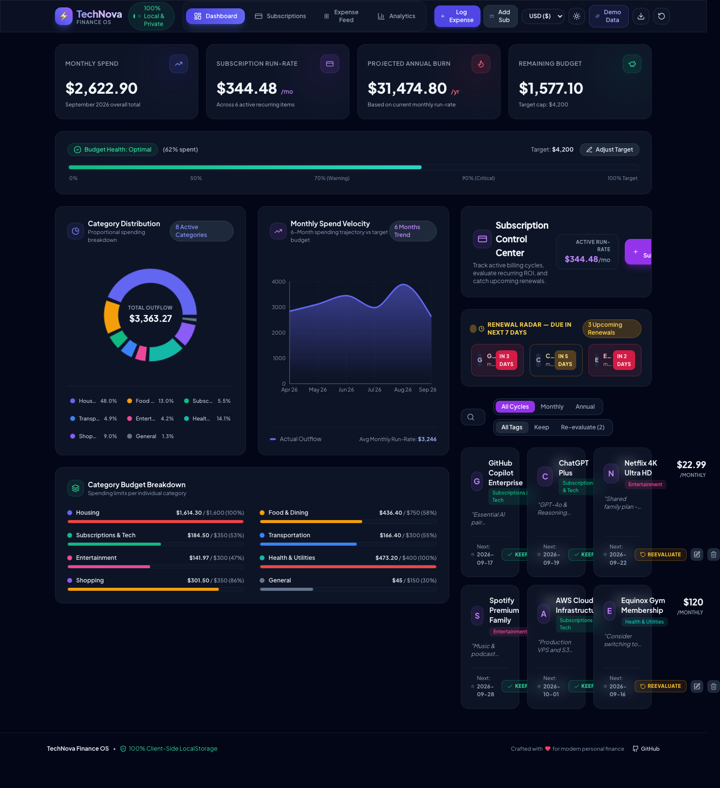
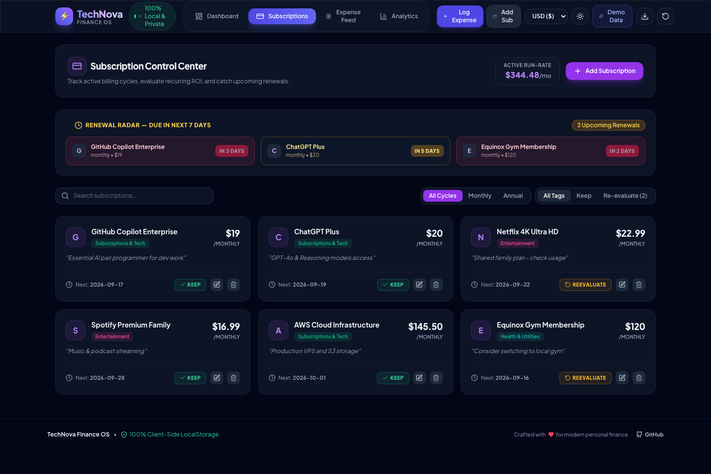
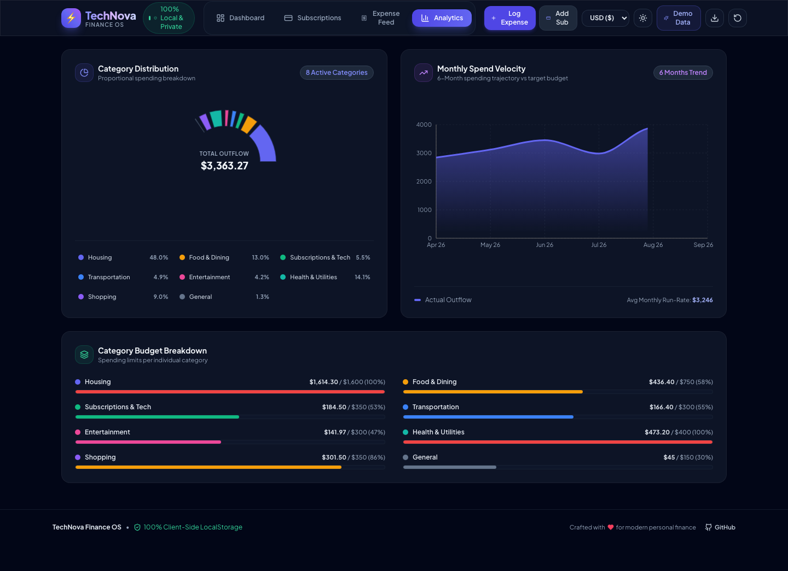
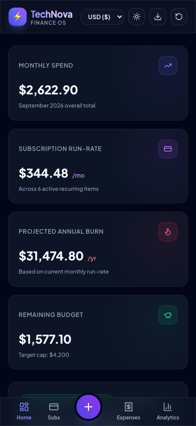

# ⚡ TechNova Finance — Personal Finance & Subscription OS

An ultra-modern, interactive, 100% client-side Personal Finance & Subscription Management platform built with **React 19**, **Vite**, **TypeScript**, **Tailwind CSS**, **Framer Motion**, and **Recharts**.

[](https://react.dev/)
[](https://vitejs.dev/)
[](https://www.typescriptlang.org/)
[](https://tailwindcss.com/)
[](#-architecture--privacy-first-design)
[](https://samar-2580.github.io/technova/)

---

## 🔗 Live Application
> **Live Site:** [https://samar-2580.github.io/technova/](https://samar-2580.github.io/technova/)

---

## 📸 Product Showcases

### 1. Dashboard Overview & Metric Hub


### 2. Subscription Control Center & Renewal Radar


### 3. Recharts Visual Analytics & Spend Trajectory


### 4. Mobile Viewport & Touch Navigation


---

## 🌟 Key Product Features

### ⚡ 1. Live Metric Hub & Dynamic Budget Health
- **Count-Up Stat Cards**: Instant real-time view of **Monthly Spend**, **Subscription Run-Rate**, **Projected Annual Burn**, and **Remaining Monthly Budget**.
- **Dynamic Health Indicator Bar**: Smooth animated progress meter that dynamically transitions colors based on budget utilization:
  - 🟢 **Emerald Green** (< 70% spent): Optimal spending rate.
  - 🟡 **Amber Yellow** (70% – 90% spent): Approaching budget cap.
  - 🔴 **Crimson Red** (> 90% spent): Critical over-budget alert.

### 💳 2. Subscription Control Center & Renewal Radar
- **Renewal Radar**: Automatic countdown badge identifying recurring items **Due in the Next 7 Days** with color-coded urgency.
- **Billing Cadence Switcher**: Toggle view between **Monthly** and **Annual** recurring commitments.
- **Value Evaluation Tags**: 1-click toggle between `[KEEP]` (High ROI) and `[RE-EVALUATE]` (Potential cancellation target).

### 📊 3. Interactive Analytics & Recharts Integration
- **Category Distribution Donut Chart**: Glowing segment highlights, hover tooltips, center sum readout, and category legend breakdown.
- **Spend Velocity Trajectory**: 6-month historical spending curve (Area + Bar combo) plotted against target budget caps.
- **Per-Category Budget Meters**: Granular progress bars tracking spending limits per expense category.

### 📝 4. Transaction Feed & Smart Filtering
- **Modal Expense Logger**: Spring physics modal powered by Framer Motion for logging transactions with field validation.
- **Real-time Search & Multi-Filters**: Instant keyword search, category selector, payment method filters (**Card**, **UPI**, **Bank**, **Cash**), and date/amount sorting.
- **In-Place CRUD Sync**: Instant updates with toast notification feedback (`react-hot-toast`).

### 💱 5. Global Currency & Theme Switcher
- **Multi-Currency Engine**: Instant conversion display between **USD ($)**, **INR (₹)**, **EUR (€)**, and **GBP (£)**.
- **Glassmorphic Dark / Light Mode**: Smooth Vercel/Linear-inspired dark glass background with seamless light theme toggle.
- **1-Click Demo Dataset & CSV Export**: Instantly populate 27+ realistic expenses and 6 subscriptions, export data to CSV, or clear state.

---

## 🏗️ Architecture & Privacy-First Design

TechNova Finance is engineered as a **100% Client-Side Single Page Application (SPA)**:

```
┌─────────────────────────────────────────────────────────┐
│                    TechNova UI Layer                    │
│   (React 19 + Framer Motion + Tailwind Glassmorphism)   │
└────────────────────────────┬────────────────────────────┘
                             │
┌────────────────────────────▼────────────────────────────┐
│                    FinanceContext                       │
│    (Reactive State Management + Notification Toasts)    │
└────────────────────────────┬────────────────────────────┘
                             │
┌────────────────────────────▼────────────────────────────┐
│                  Storage Service Layer                  │
│       (Browser LocalStorage + Auto Demo Seeding)        │
└─────────────────────────────────────────────────────────┘
```

- **Zero Backend Required**: Operates strictly in the browser using HTML5 `localStorage`. No credentials, database servers, or external tracking required.
- **GitHub Pages Base Path**: Configured with Vite `base: './'` so static assets resolve cleanly on relative paths.
- **Responsive Layout**: Designed mobile-first with a dedicated bottom navigation bar for small screens.

---

## 🛠️ Tech Stack & Dependencies

- **Core Framework**: [React 19](https://react.dev/), [TypeScript 5.7](https://www.typescriptlang.org/)
- **Build Tool**: [Vite 6](https://vitejs.dev/)
- **Styling**: [Tailwind CSS](https://tailwindcss.com/), PostCSS, Autoprefixer
- **Animations**: [Framer Motion 12](https://www.framer.com/motion/)
- **Charts**: [Recharts 2.15](https://recharts.org/)
- **Icons**: [Lucide React](https://lucide.dev/)
- **Toast Notifications**: [React Hot Toast](https://react-hot-toast.com/)
- **Effects**: [Canvas Confetti](https://www.npmjs.com/package/canvas-confetti)
- **Automated Testing & Screenshots**: [Playwright](https://playwright.dev/)

---

## 🚀 Quickstart & Development

### 1. Clone the Repository
```bash
git clone https://github.com/samar-2580/technova.git
cd technova
```

### 2. Install Dependencies
```bash
npm install --legacy-peer-deps
```

### 3. Launch Development Server
```bash
npm run dev
```
Open [http://localhost:5173](http://localhost:5173) in your browser.

### 4. Build for Production
```bash
npm run build
```
The compiled static assets will be output to the `dist/` directory.

### 5. Capture Automated UI Screenshots
```bash
npm run capture-screenshots
```

---

## 📦 Deployment to GitHub Pages

The repository contains an automated GitHub Actions workflow (`.github/workflows/deploy.yml`).

When changes are pushed to the `main` branch:
1. GitHub Actions sets up Node.js 20.
2. Installs dependencies (`npm ci`).
3. Compiles the project (`npm run build`).
4. Deploys the static `dist/` folder to GitHub Pages (`https://samar-2580.github.io/technova/`).

---

## 👨‍💻 Author

**Samarpreet Singh**
- GitHub: [https://github.com/samar-2580](https://github.com/samar-2580)
- Live App: [https://samar-2580.github.io/technova/](https://samar-2580.github.io/technova/)
