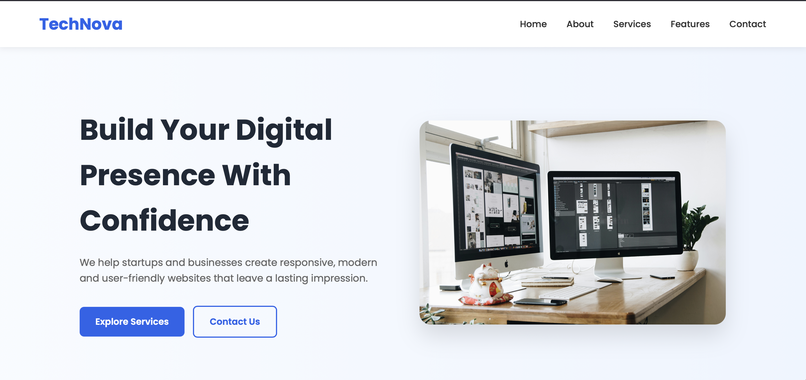

# 🌐 Responsive Frontend Landing Page

A modern and responsive landing page built using HTML5, CSS3, and Vanilla JavaScript. This project was developed as part of a fullstack virtual internship to demonstrate responsive web design, clean UI development, and basic JavaScript interactivity.

## 🚀 Live Demo

🔗 Live Website:  
https://samar-2580.github.io/responsive-frontend/

## 📸 Project Preview

 

## ✨ Features

- 📱 Fully Responsive Design
- 🧭 Sticky Navigation Bar
- 🎯 Hero Section
- 👨‍💼 About Section
- 💼 Services Section
- ⭐ Features Section
- 📬 Contact Form with JavaScript Validation
- 🍔 Mobile Navigation Menu
- 🎨 Clean and Modern User Interface
- ⚡ Smooth Scrolling Experience

## 🛠️ Technologies Used

- HTML5
- CSS3
- JavaScript (ES6)

## 📁 Project Structure

responsive-frontend/
│
├── images/
│   ├── hero.jpg
│   ├── about.jpg
│   └── ss.png
│
├── index.html
├── style.css
├── script.js
└── README.md

## ▶️ Getting Started

### Clone the repository

bash git clone https://github.com/samar-2580/responsive-frontend.git 

### Open the project

bash cd responsive-frontend 

Open index.html directly in your browser, or use the Live Server extension in Visual Studio Code for the best experience.

---

## 📱 Responsive Design

The website is optimized for:

- 💻 Desktop
- 💼 Laptop
- 📱 Mobile
- 📲 Tablet

---

## 🎯 Learning Outcomes

This project demonstrates:

- Semantic HTML5
- CSS Flexbox
- CSS Grid
- Responsive Web Design
- JavaScript DOM Manipulation
- Event Handling
- Form Validation
- Organized Project Structure
- Git & GitHub Workflow

---

## 👨‍💻 Author

Samarpreet Singh

GitHub: https://github.com/samar-2580

---

## 📄 License

This project was created for educational and learning purposes as part of a frontend development intern
